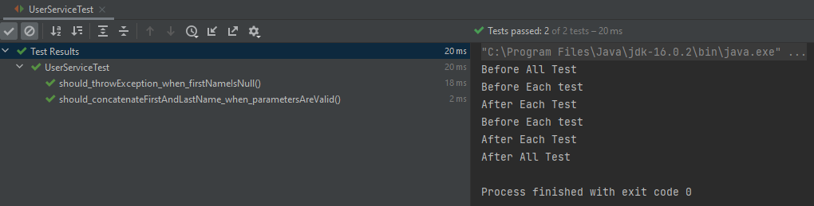

# Unit Testing with Junit and Mockito

Unit tests can be defined by tests created to test specific functionalities within the developed code. These tests should cover either good and bad paths that can be reached during this piece of code execution.

As Uncle Bob describes in the Clean Code book, unit tests should be written following the **F.I.R.S.T** rule:

**Fast:** Tests should be able to run quickly so that developers can run them frequently. This helps finding the issues early on code development.

**Independent:** Tests should not depend on each other

**Repeatable:** Tests should be able to run on every environment. If they are not repeatable in all scenarios its always possible to find an excuse on why they fail.

**Self-Validating:** Tests should either pass or fail, nothing else.

**Timely:** Tests should be written just before the code that makes them pass. Creating tests after the code was developed makes the test creations harder than it should be, since you may find the produced code too hard to test. The timely property fits well with the Test-Driven-Development (TDD) implementation.

For the sake of keeping with the Junit and Mockito scope of this tutorial, TDD techniques will not be commented or implemented here.


## Using JUnit

Inside java development, JUnit is a tool responsible for developers-side testing.

**@Test Annotation**

With JUnit, a new test class can be created to store the test methods related to the class we are willing to test. For example:

UserService class is responsible for manipulating user data. Is this case we want to make sure the functionality ConcatenateFirstAndLastName is working properly.
With that, we can create a new UserServiceTest class containing a test function that used the @Test annotation. With this annotation we are saying that this method is a Test method.

```java
public class UserService {
    public String ConcatenateFirstAndLastName(String firstName, String lastName){
        return firstName.concat(lastName);
    }
}
``` 

```java
class UserServiceTest {
    @Test
    void should_concatenateFirstAndLastName_when_parametersAreValid() {
        UserService userService = new UserService();
        String fullName = userService.ConcatenateFirstAndLastName("Ana", "Weidner");
        assertEquals(fullName, "AnaWeidner");
    }
}
``` 
In the example listed above, the assertEquals method is being used to validate if the ConcatenateFirstAndLastName method returns the expected result. Junit provides a full list of assertion methods for asserting conditions inside our tests.

**AssertTrue Example**

```java
class UserServiceTest {
    @Test
    void should_ConcatenateFirstAndLastName_when_parametersAreValid() {
        String fullName = userService.ConcatenateFirstAndLastName("Ana", "Weidner");
        assertTrue(fullName.equals("AnaWeidner"));
    }
}
``` 

**AssertThrows Example**

In our first example, the String.concat function throws a NullPointer exception if the first string is null. Since there is no exception handling, the ConcatenateFirstAndLastName is going to throw this exception as well. The assertThrows method can be used to verify if the specified exception was thrown when the tested method was called.

```java
class UserServiceTest {
    @Test
    void should_throwException_when_firstNameIsNull() {
        assertThrows(NullPointerException.class, () -> {
            userService.ConcatenateFirstAndLastName(null, "Weidner");
        });
    }
}
``` 

There are many more Assertions methods that can be used to assert the code functionality. You can check the full list of assert methods [here](https://junit.org/junit5/docs/5.0.1/api/org/junit/jupiter/api/Assertions.html).

**@BeforeAll @BeforeEach annotations**

Methods with the **@BeforeAll** annotation are going to run once before all tests run. This annotation is useful when we need to setup a variable that is reused inside all tests.

Methods with the **@BeforeEach** annotation are going to run before each test in the test class. This method is useful when there is the need of creating a new common object for each test.

**@AfterAll @AfterEach annotations**

The **@AfterAll** and **@AfterEach** have a close behavior related to the **@BeforeAll** and **@BeforeEach** annotations, only running after tests as its main difference. Those methods are useful for cleaning context.

```java
class UserServiceTest {
    @BeforeEach
    public void setupBeforeEach() {
        System.out.println("Before Each test");
    }
    @BeforeAll
    public void setupBeforeAll() {
        System.out.println("Before All Test");
    }
    @AfterEach
    public void cleanUpAfterEach() {
        System.out.println("After Each Test");
    }
    @AfterAll
    public static void cleanUpAfterAll() {
        System.out.println("After All Test");
    }
}
```


## Using Mockito to Mock Code Dependencies:

One important concept of unit testing is keeping up with the test scope and know what you are testing. While testing a specific functionality we don't want to worry about other classes that interact with that functionality. In this case, Mockito helps us simulating the behavior of this dependent classes.

Still following the **UserService** example, we are now saving the results in a **UserRepository**:

```java
public class UserService {
    public boolean SaveOnDatabase(String fullName){
        return userRepository.save(fullName);
    }
}
```
```java
public class UserRepository {
    public boolean save(String fullname){
        System.out.println(String.format("Saving fullName in database: %s", fullname));
        //DATABASE LOGIC
        return true;
    }
}
``` 
While testing this method, we don't want to deal with any behavior inside the UserRepository Class. Our main objective is to test the saveOnDatabase method functionality from UserService, ignoring any other behavior from UserRepository.
To achieve this objective, we can mock the UserRepository class with the **@Mock** annotation. Since UserService class requires an UserRespotitory for its constructor, we can use the **@InjectMocks** annotation to inject the mocked or spied classes.

```java
class UserServiceTest {
    @Mock
    private UserRepository userRepository;
    @InjectMocks
    private UserService userService;
}
``` 
Using the **@Mock @Spy** and **@InjectMocks** it is required to use the openMocks function to initialize all mocks inside this test class:

```java
class UserServiceTest {
    @BeforeAll
    public void setupBeforeAll() {
        MockitoAnnotations.openMocks(this);
        System.out.println("Before All Test");
    }
}
``` 
Creating a test for the SaveOnDatabase method it is expected it to return true:

```java
class UserServiceTest {
    @Test
    void should_callSaveMethodAndGetResultValue_when_SaveOnDatabaseMethodIsCalled() {
        Boolean wasSavedOnDatabase = userService.SaveOnDatabase("AnaWeidner");
        assertTrue(wasSavedOnDatabase);
    }
}
```
Running this test, we get a failed result. That happens due to the UserRepository object being a mocked object. Methods inside the Mocked object will not return their true value, instead it is expected from the developer to specify how the mock methods should behave.

Mockito's when method can be used to define mocks behaviors. Fixing the previous example, we are telling the code to return true when it calls the UserRepository.Save function with any parameters:

```java
class UserServiceTest {
    @Test
    void should_callSaveMethodAndGetResultValue_when_SaveOnDatabaseMethodIsCalled() {
        when(userRepository.save(any())).thenReturn(true);
        Boolean wasSavedOnDatabase = userService.SaveOnDatabase("AnaWeidner");
        assertTrue(wasSavedOnDatabase);
    }
}
```

Another way of testing this class is to use the verify method to identify if the UserRepository save method was called at least once during this test execution.

```java
class UserServiceTest {
    @Test
    void should_callSaveMethod_when_SaveOnDatabaseMethodIsCalled() {
        userService.SaveOnDatabase("AnaWeidner");
        verify(userRepository, atLeastOnce()).save("AnaWeidner");
    }
}
```

Mockito also shares the **@Spy** annotation. Comparing to Mocks, in mocked objects the real methods are never called, since Mockito expects us to declare what is the expected behavior for that method. With spied objects real methods are still invoked but still can be verified and stubbed if needed (also called partial-mock). Check the below example:

```java
class SpyExampleTest {
    @Test
    public void should_notAddStringToList_when_usingMockedObjects() {
        List mockedList = mock(ArrayList.class);
        mockedList.add("test");
        verify(mockedList).add("test");
        assertEquals(0, mockedList.size());
    }
    @Test
    public void should_addStringToList_when_usingSpiedObjects() {
        List spiedList = spy(ArrayList.class);
        spiedList.add("test");
        verify(spiedList).add("test");
        assertEquals(1, spiedList.size());
    }
}
```
On the first test, the list size doesn't change since the object is a mocked object and the add method does not behave like the real object. On the second test, the list size returns one since it was not stubbed so the "test" String was added to the real object.

## References:

**Junit User Guide:** https://junit.org/junit5/docs/current/user-guide/

**Mockito Documentation:** https://javadoc.io/doc/org.mockito/mockito-core/latest/org/mockito/Mockito.html

**Uncle Bob's Clean Code Book:** Martin, Robert C. Clean Code: A Handbook of Agile Software Craftsmanship. Upper Saddle River, NJ: Prentice Hall, 2009.

